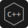
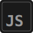

  

  

  <code>Technology is a tool that changes culture, but people fill the new cultural form with their own content.</code>

 

  

  <table>
    <tr>
      <td align="center" width="124" height="92">
        
         
        <b>Python</b>
      </td>
      <td align="center" width="124" height="92">
        
         
        <b>C++</b>
      </td>
      <td align="center" width="124" height="92">
        
         
        <b>Rust</b>
      </td>
      <td align="center" width="124" height="92">
        
         
        <b>JavaScript</b>
      </td>
      <td align="center" width="124" height="92">
        
         
        <b>SQL</b>
      </td>
    </tr>
    <tr>
      <td align="center" width="124" height="92">
        
         
        <b>Web</b> · HTML + CSS
      </td>
      <td align="center" width="124" height="92">
        
         
        <b>Git</b>
      </td>
      <td align="center" width="124" height="92">
        
         
        <b>TensorFlow</b>
      </td>
      <td align="center" width="124" height="92">
        
         
        <b>HPC</b> · High Performance
      </td>
      <td align="center" width="124" height="92">
        
         
        <b>Arduino</b>
      </td>
    </tr>
  </table>

 

  

  <table>
    <tr>
      <td align="center">
        
      </td>
      <td align="center">
        
      </td>
    </tr>
  </table>

  

 

  

  <table>
    <tr>
      <td align="center" width="124" height="90">
        
         
        Email
      </td>
      <td align="center" width="124" height="90">
        
         
        LinkedIn
      </td>
      <td align="center" width="124" height="90">
        
         
        Instagram
      </td>
      <td align="center" width="124" height="90">
        
         
        Steam
      </td>
      <td align="center" width="124" height="90">
        
         
        Facebook
      </td>
    </tr>
  </table>

  

 

  

